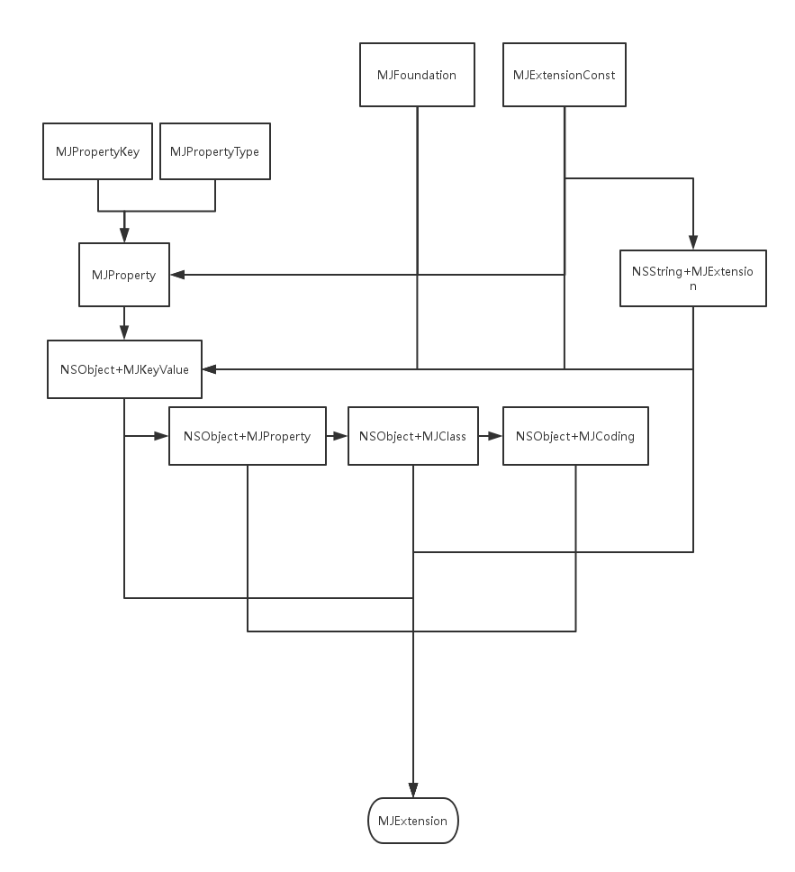

# MJExtension-Source-Analyse
MJExtension Source code analyse。

* MJExtension 头文件
* MJExtensionConst 宏定义
* MJFoundation 判断是否是类
* MJProperty 成员属性
* MJPropertyKey 属性Key
* MJPropertyType 包装类型
* NSObject+MJClass 类相关的扩展
* NSObject+MJCoding 归档扩展
* NSObject+MJKeyvalue 字典模型转换
* NSObject+MJProperty 成员属性相关的扩展
* NSString+MJExtension 字符串扩展方法

####字典转模型流程
1. mj_objectWithKeyValues:方法进入（可传入字典，字符串，NSData）
2. mj_objectWithKeyValues: context: 得到字典，无法转换成字典，就地返回。
3. mj_setKeyValues:－>mj_setKeyValues: context:此处为核心代码。
4. 获取白名单和黑名单，它使用协议的方式（KeyValue协议），需要在要转化的对象里面实现它定义的方法，并返回白名单或者黑名单数组。
5. mj_enumerateProperties:获取成员变量，如果缓存中有，取出，没有，进入mj_enumerateClasses:(MJClassesEnumeration)enumeration遍历取出成员变量。
6. mj_getNewValueFromObject: property:对值进行过滤，如id->ID的处理。
7. 对数组的转化,如果最后类型不匹配就赋值为nil。
8. 最后用kvc赋值

#### 模型 -> 字典
1. mj_keyValues进入转换
2. mj_keyValuesWithKeys: ignoredKeys:中进行处理。如果自己不是模型类, 那就返回自己。
3. 遍历处理，检查是否有忽略的属性，有的话不做处理。
4. 取出属性值
5. 判断字典的key是否参考replacedKeyFromPropertyName，有的话，属性更改（如ID－>id）,遍历赋值
6. 返回

#### 模型数组 -> 字典数组
1. 使用mj_keyValuesArrayWithObjectArray:
2. 核心方法mj_keyValuesArrayWithObjectArray:keys: ignoredKeys:
3. 遍历调用mj_keyValuesWithKeys方法
4. 在mj_keyValuesWithKeys:ignoredKeys:中处理
5. 返回数组。

